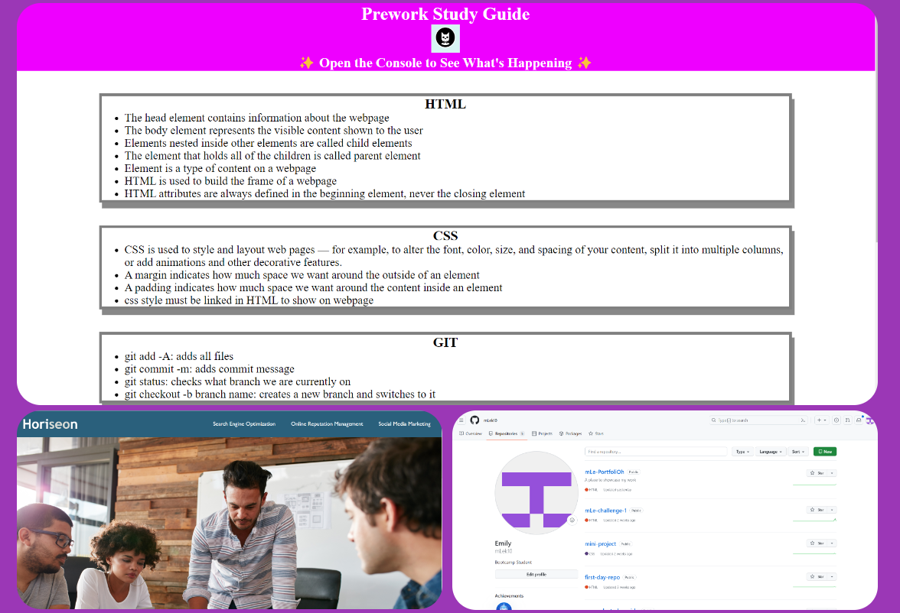
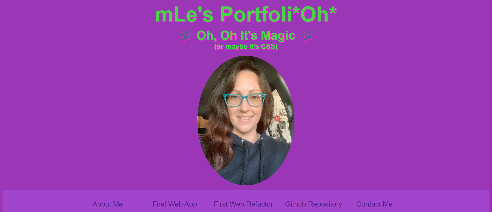
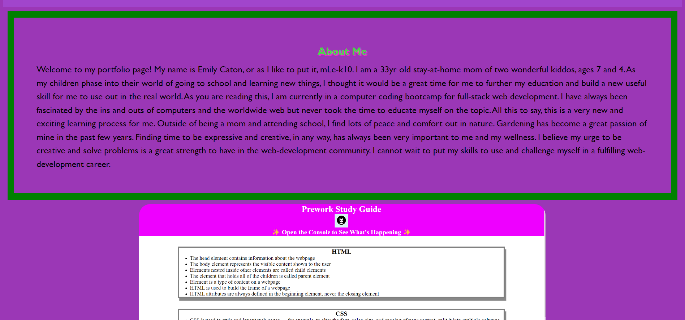
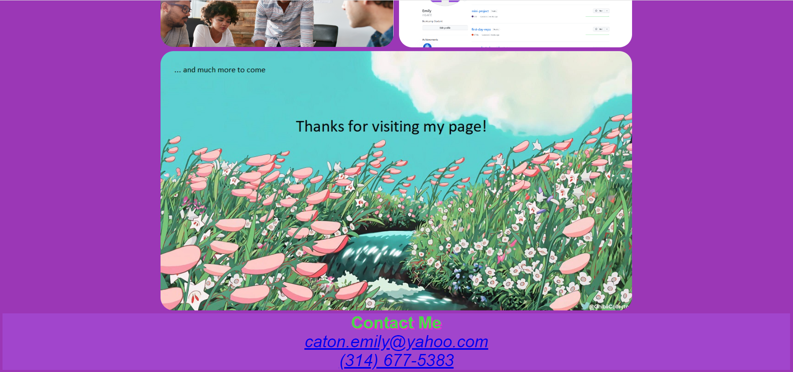

# mLe-PortfoliOh

## Description

My motivation for this project was to create a portfolio page to display the work I have done thus far for potential employers. It includes information like my name, a picture of me, contact info, and some images of my projects that double as links to take you to those deployed sites. I am able to direct anyone to this site to view all of my work in one place as opposed to having to send multiple references to my projects. This challenge was a huge learning process for me, getting the more advanced CSS terms to click in my mind was more difficult than I anticipated but I persevered and am proud of what I was able to accomplish.

## Usage

When you click the navigation links or scroll down you will be brought to these images, you can click on the image and you will be redirected to that specific deployed site

## Screenshots

Screenshots of my project for challenge 2

